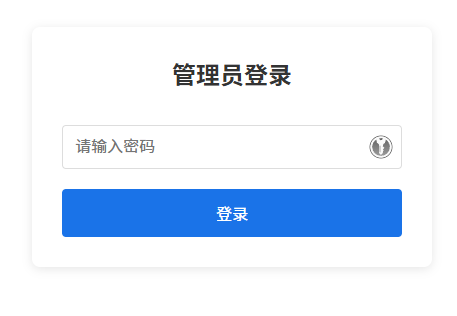
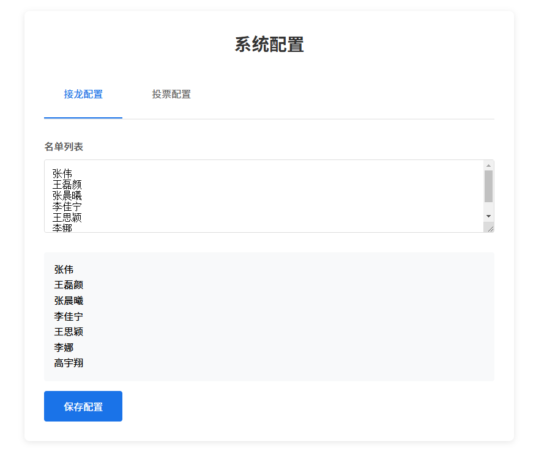
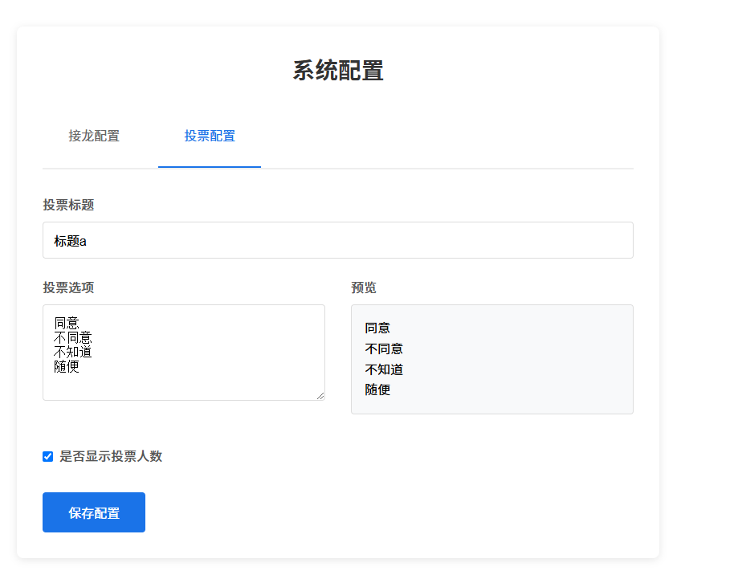
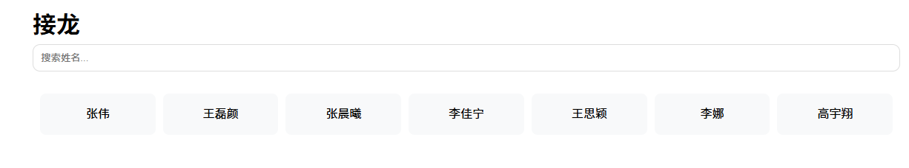
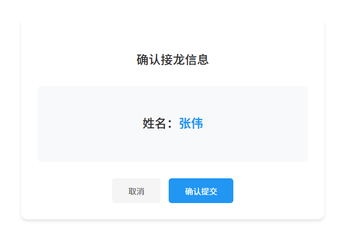
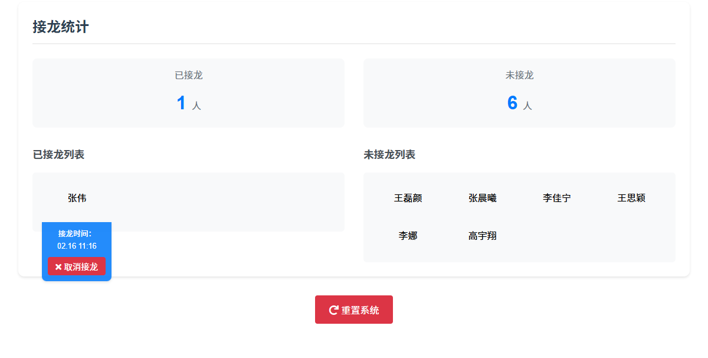
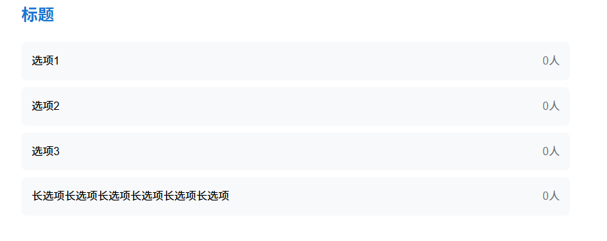
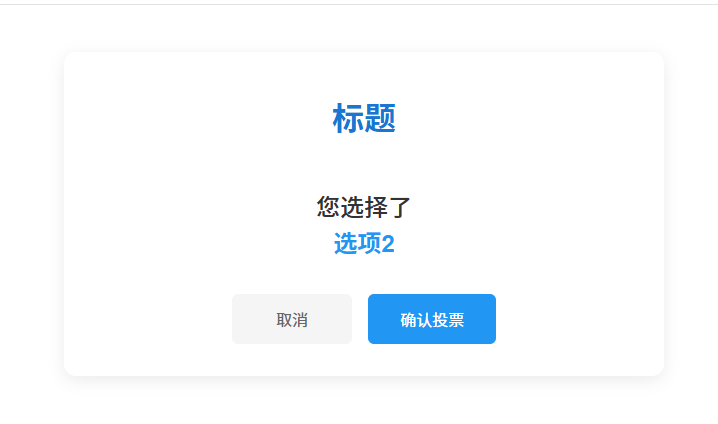
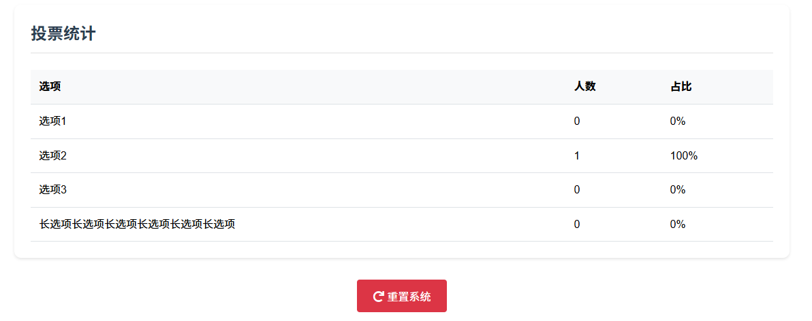

# 投票与接龙系统

一个基于Flask的简单投票和接龙网页应用。

功能单一简单，单纯是网上的那些用的不舒服，拿AI花了几个小时写的。

投给AI的Prompt放在[doc.md](doc.md)里了，Github Copilot用Claude写的。

**DEMO：https://demo.flt6.top/**


## 功能特点

- 投票功能
  - 可配置是否显示投票计数
  - 实时统计投票结果
  - 支持百分比显示
- 接龙功能
  - 快速搜索（支持拼音搜索和首字母搜索）
  - 统计参与情况
  - 记录接龙时间
- 支持手机和电脑端
- 后台管理功能
  - 配置投票选项
  - 管理接龙名单
  - 查看统计数据

## 安装与运行

1. 安装依赖：
```bash
pip install -r requirements.txt
```

2. 运行应用：
```bash
python run.py
```

应用将在 http://localhost:5012 启动

## 使用

1. 管理员密码通过环境变量`ADMIN_PASSWORD`设置，如未设置，使用`admin`

2. 第一次使用，显示`未配置，请稍后`。进入http://<你的域名或localhost>/admin/后输入密码进入配置页


3. 配置页分为接龙和投票。

接龙模式：名单一行一个人名，按下回车后下方显示列表预览。（示意图人名由AI随机生成，如有冒犯请见谅）


投票模式：选项一行一个，按下回车后右侧显示预览。


4. 配置完成后，进入后台统计页面。直接访问域名显示前台。

接龙模式，前台点击姓名即可接龙，上方搜索栏支持精确搜索、拼音搜索、首字母搜索



后台显示已接龙和未接龙人数以及列表。点击未接龙列表人名，设为已接龙；点击已接龙列表人名，显示接龙时间和取消接龙按钮。


投票模式，前台点击选项即可投票



后台显示各选项投票人数和百分比



## 数据存储

统使用JSON文件进行数据持久化存储，数据文件保存在`data`目录下：
- vote.json: 投票数据
- chain.json: 接龙数据
